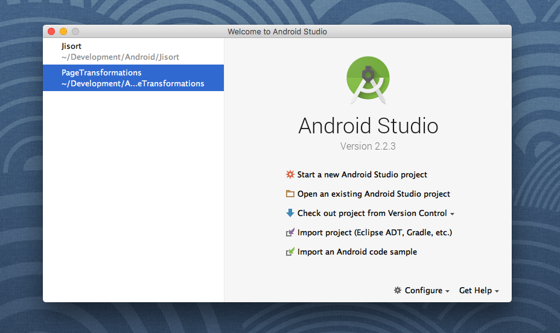

# Contributing

Mozilla Foundation currently (as of 2016) uses Mattermost as our communications solution. If at any point you need help, have a question or just want to say hello; join our [chat room](https://chat.mozillafoundation.org).

* [Install Android Studio](#install-android-studio)
    * The first step of getting set up for Android development is installing Android Studio.
* [USB Debugging](#usb-debugging)
    * USB debugging allows you to use your phone in order to test your app changes and debug them if necessary.
* [Setup Jisort App](#setup-jisort-app)
    * All the steps needed to get a local version of the Jisort! app repository running locally on your Android phone.
* [Review MoFo Engineering Standards](#review-mofo-engineering-standards)
    * Mozilla Foundation's engineering standards is a guide book that details best practices when contributing.
* [Building Jisort App](#building-jisort-app)
    * Information on how to build Jisort! as well as a table with all build types and descriptions.

## Install Android Studio

  * Verify that you have Java 1.8 and [JDK](http://www.oracle.com/technetwork/java/javase/downloads/jdk8-downloads-2133151.html) installed for your platform

  * Download and install Android Studio from: https://developer.android.com/studio/index.html

  * After it has installed successfully, you should see the following screen:

  
## USB Debugging

  * In order to start testing apps on your physical Android device, we need to first activate developer mode by tapping ```Settings > About > Build Number``` seven times

  * Once activated, go to ```Settings > Developer Options > USB Debugging``` and make sure USB Debugging is enabled

  * Connect your phone to your computer via USB and select the green "run" button from the Android Studio tool bar or hit ```Run > Run 'app'``` from the menu bar. Your device should show up under the "Connected Devices" tab. If you've installed Android command line tools, you can also verify your phone is connected by running ```adb devices``` from the command line

  * [This guide](http://www.howtogeek.com/129728/how-to-access-the-developer-options-menu-and-enable-usb-debugging-on-android-4.2/) has additional information for enabling USB Debugging

## Setup Jisort App

  * Clone the Jisort code repository from [mozilla/Jisort](https://github.com/mozilla/Jisort)

  * In Android Studio, choose "Open an existing Android project"

  * Select the Jisort folder, and press open

  * Connect your device via USB, and press the "run" button:


## Review MoFo Engineering Standards

The Mozilla Foundation engineering standards guidebook outlines the best practices used by Mozilla Foundation's engineering team. It provides helpful information to first time and veteran contributors alike.

Jisort! is a mofo-standard compliant repository, we follow these standards where ever applicable.

You can review the guidebook [here](https://github.com/MozillaFoundation/mofo-standards).

## Building Jisort App

There are currently four build types for Jisort! See the table below for a description of each one.

| Build Type | Description |
| ---------- | ----------- |
| debug | Recommended build type for testing code changes |
| latest | Strips semantic versioning information, used for build deployment |
| qualityassurance | Considered a "pre-release" build candidate for release |
| release | Approved release build, signed with non-debug Mozilla signature |


To assemble a specific build type, append it to the end of the assemble build type like this:

```./gradlew assembleDebug```

If you don't specify a build type (i.e. ```./gradle assemble```) Gradle will assemble all build types.

You can also assemble and install the APK directly on your phone if it's connected over the adb (Android Device Bridge) by using the Gradle ```install``` task and appending the build type you'd like to install to the end like this:

```./gradlew installDebug```

